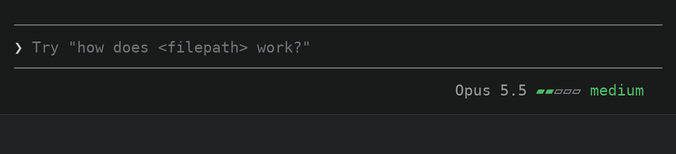

# effort-cycle

Per-agent effort levels for Claude Code: step them from the keyboard, see them
at a glance.



- **Ctrl+↑ and Ctrl+↓** step the level: low, medium, high, xhigh, max.
- **Per agent.** The keys change the agent in view. Every other agent keeps its level.
- **A meter in the footer**, colored cool to hot: `Opus 5.5 ▰▰▰▱▱ high`.
- **Clickable ‹ ›** appear around the meter when you point at it.
- **The tasks list** shows each subagent's model and level in its row.
- **`/config` toggles** choose which levels the keys step through.

## Install

```
/plugin marketplace add Anerco/plugins
/plugin install effort-cycle@anerco
```

There is nothing to bind: the keys work right away. The tasks list's rows need
`python3` on your `PATH` (on macOS, from `xcode-select --install` or Homebrew).

**macOS:** Ctrl+↑ and Ctrl+↓ are Mission Control's shortcuts by default. Use
Option+↑ and Option+↓ instead, with your terminal set to send Option as Meta
(Terminal.app: **Use Option as Meta key**; iTerm2: **Left Option key** set to
**Esc+**; Ghostty: `macos-option-as-alt = true`).

**Updates:** in `/plugin`, choose Marketplaces → anerco → Enable auto-update.
Or run `claude plugin update effort-cycle@anerco` and restart Claude Code.

Built and tested against Claude Code 2.1.291. effort-cycle is a mod (a plugin
of function hooks), an early-access API that changes between releases.

## Usage

| Control | What it does |
| --- | --- |
| Ctrl+↑ | One level up for the agent in view, stopping at max |
| Ctrl+↓ | One level down, stopping at low |
| **‹** and **›** in the footer | Point at the footer's label, then click ‹ to step down or › to step up |
| `/effort`, Alt+P | Claude Code's own controls still work, and take over from the plugin's pick |

The agent in view is the main thread, or the subagent whose transcript you
opened from the tasks list. A pick lasts for the session. The footer shows the
agent's model and level, led by its type in a subagent's transcript:

```
Opus 5.5   ▰▰▰▱▱ high                 main thread
Opus 5.5 ‹ ▰▰▰▱▱ high   ›             pointer on the label
Explore · Opus 5.5   ▰▰▱▱▱ medium     a subagent's transcript
```

The colors follow your theme, from gray at low to red at max. At max the
model's name turns red too, and a light sweeps the bar while Claude works.
Each Agent call in the transcript gets a line with its agent's level.

### Levels in the tasks list

Each subagent's row in the tasks list under the prompt shows its model and
level, in the footer's colors:

```
◯ Fix the parser · Opus 5.5 ▰▰▰▱▱ high · Reading the failing test · 53m 11s · ↓ 499.8k tokens
◯ Find the config · Sonnet 5.5 ▰▰▱▱▱ medium · Searching settings · 2m 4s · ↓ 31.2k tokens
```

The rows take no clicks; open a subagent's transcript to step it. Claude Code
redraws them every five seconds, or in about 0.4 s with **Tasks list rows:
update at once** on ([Settings](#settings)).

### Where a level starts

The main thread starts at the level Claude Code gives its model:
`CLAUDE_CODE_EFFORT_LEVEL` if it is set, else a level your settings save for
the model (as `/effort` and Alt+P save one), else the model's default: medium
on Opus 5.5 and Sonnet 5.5, xhigh on Opus 4.7, high on the rest.

A subagent starts at its definition's `effort`, else the main thread's level.
Its meter is empty (`—`) until its first model request says which, a moment
after it starts; a press before then shows `wait`.

## Settings

The plugin adds these toggles to `/config`:

| Toggle | Default | What it does |
| --- | --- | --- |
| Effort keys: include low | on | The keys and ‹ › step through low |
| Effort keys: include medium | on | … through medium |
| Effort keys: include high | on | … through high |
| Effort keys: include xhigh | on | … through xhigh |
| Effort keys: include max | on | … through max |
| Tasks list rows: update at once | off | Rows follow a change in about 0.4 s, not up to 5 s |

A level that is off is skipped for every model. **Update at once** narrows the
terminal by one column and back on each change, so the right edge flickers
briefly; it needs `python3` ([details](docs/how-it-works.md#rows-that-follow-at-once)).
The values are saved in `~/.claude/settings.json` under `pluginConfigs`.

## Known issues

- **The spinner can show a different level from the footer**
  ([#1](https://github.com/Anerco/claude-code-effort-cycle/issues/1)). The
  footer shows the level requests go out with.
- **A pick is lost on restart.** A plugin cannot write settings, so it cannot
  save the level the way `/effort` and Alt+P do.
- **Before the first request, the footer works the level out.** An
  organization's default, or one set on Anthropic's side, can differ. From the
  first request the footer follows Claude Code; a pick made before it stands.
- **A subagent shows `—` until its first model request.** One started before
  the plugin loaded shows no model either, until its next request.
- **‹ › need mouse events**, as in Claude Code's fullscreen view. In tmux, add
  `set -g mouse on`. Without them, use the keys.
- **Ctrl+↑ and Ctrl+↓ are borrowed from the diff panel.** While `/diff` lists
  more than eight files they scroll it instead; close it to step again.
  Rebinding `app:diffFileListUp` and `app:diffFileListDown` moves them too.
- **On macOS, Ctrl+↑ and Ctrl+↓ belong to Mission Control** unless you turn
  them off in System Settings → Keyboard → Keyboard Shortcuts → Mission
  Control. Option+↑ and Option+↓ work too ([Install](#install)).
- **The tasks list's levels need `python3`.** A `subagentStatusLine` in your
  own settings replaces the plugin's. On Windows they show only where Claude
  Code runs commands through Git Bash.
- **Ultracode is not a step.** It is a separate switch the plugin API cannot reach.

## How it works

See [docs/how-it-works.md](docs/how-it-works.md) for what the plugin hooks, the
tasks list's row files, Remote Control and development.

## Privacy

No telemetry, no network requests. effort-cycle reads your settings,
`CLAUDE_CODE_EFFORT_LEVEL` and the session's model and agents, and keeps levels
in the session. For the tasks list it writes subagent levels under
`~/.claude/subagent-rows/sessions/` (deleted after a week) and sets one variable,
`EFFORT_CYCLE_ROWS`.

## License

[MIT](LICENSE)
